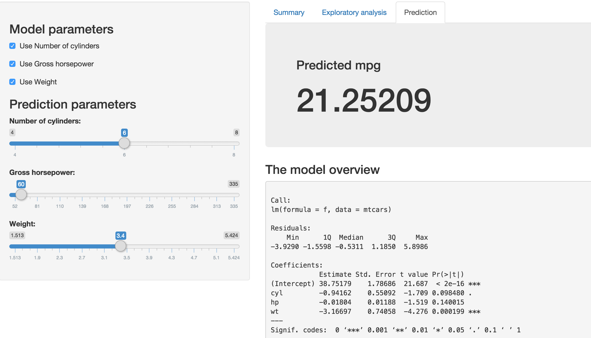

---
title       : Developing Data Products class project
subtitle    : Playing with Slidify
author      : Elena Chernousova
job         : QA Manager
framework   : io2012        # {io2012, html5slides, shower, dzslides, ...}
highlighter : highlight.js  # {highlight.js, prettify, highlight}
hitheme     : tomorrow      # 
widgets     : [bootstrap, quiz]  # {mathjax, quiz, bootstrap}
mode        : selfcontained # {standalone, draft}
knit        : slidify::knit2slides
--- 

## Presentation agenda

The presentation has been created as a part of Developing Data Products class project to exsercise 
gained skills and knowledge in creating the products ready to be distributed and reuse for general audience. The fisrt part of the class project is creating the app using Shiny and the second is applying Slidify to create a presentation which is going to be give a persation of Shiny app. 

--- .class #id 

## The description of the app 

1. The app is created to do prediction of mpg based on Mtcars dataset. 
2. UI elements include: tabs, panels, checkboxes, sliders, histograms. 
3. Linear model is hidden and it calculates the outcome very quickly.  

The app is available here:  https://wertic.shinyapps.io/Mtcars_dataproduct

--- .class #id 

## Visial representation

<div style='text-align: center;'>
    
</div>

--- .class #id 

## Linear model 

```r
    model <- lm(mpg~cyl+wt+hp, data = mtcars)
    summary(model)
```

```
## 
## Call:
## lm(formula = mpg ~ cyl + wt + hp, data = mtcars)
## 
## Residuals:
##     Min      1Q  Median      3Q     Max 
## -3.9290 -1.5598 -0.5311  1.1850  5.8986 
## 
## Coefficients:
##             Estimate Std. Error t value Pr(>|t|)    
## (Intercept) 38.75179    1.78686  21.687  < 2e-16 ***
## cyl         -0.94162    0.55092  -1.709 0.098480 .  
## wt          -3.16697    0.74058  -4.276 0.000199 ***
## hp          -0.01804    0.01188  -1.519 0.140015    
## ---
## Signif. codes:  0 '***' 0.001 '**' 0.01 '*' 0.05 '.' 0.1 ' ' 1
## 
## Residual standard error: 2.512 on 28 degrees of freedom
## Multiple R-squared:  0.8431,	Adjusted R-squared:  0.8263 
## F-statistic: 50.17 on 3 and 28 DF,  p-value: 2.184e-11
```

--- &radio
## Fun quiz

What could be done to improve the app? 

1. _More attrcative design_
2. Put more effort in data organizination
3. Create more advanced model for prediction
4. Add more description for each step of the reseach  

*** .hint
Shiny allows to customize design for the web-app. 

*** .explanation
Knowning shiny give advantage in creating real web-app with interactive design. However, it does not require advanced skiils in R.      

--- .class #id 

## Thanks for attention!


